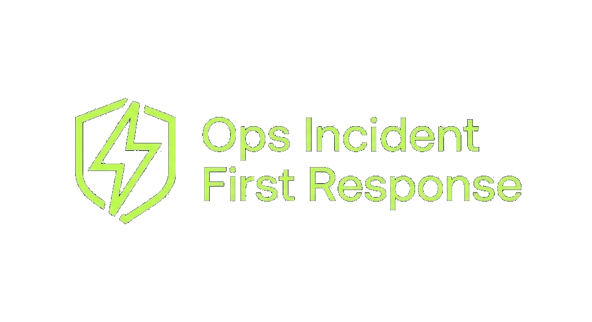
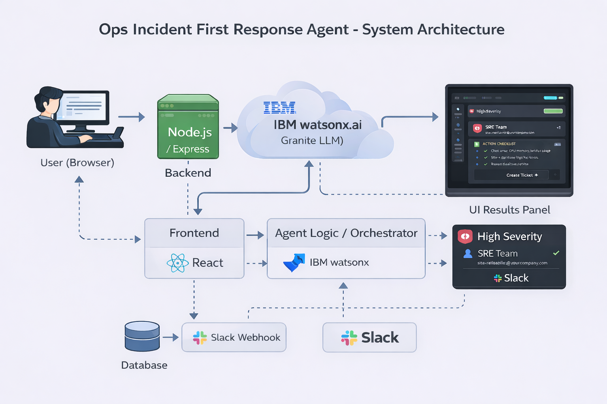

# Ops Incident First Response Agent

> **IBM Dev Day — AI Demystified Hackathon**

An agentic AI solution that automates first-response operations incidents using **IBM watsonx Orchestrate**. The agent handles classification, owner assignment, ticket creation, next-step recommendations, and team notifications—reducing mean time to response from hours to seconds.

**Live deployment URL:** [https://ops-incident-first-response-agent-v.vercel.app/](https://ops-incident-first-response-agent-v.vercel.app/)

---

##  Problem Statement

Operations teams are overwhelmed by incident alerts. Manual triage causes:

- Delayed response times
- Inconsistent classification
- Incorrect routing
- Missed escalations

## Solution

An intelligent first-response agent that:

1. **Classifies** incidents by severity and category
2. **Assigns** the right owner based on skills and availability
3. **Creates** tickets with full context
4. **Recommends** immediate next steps
5. **Notifies** stakeholders in real-time

##  Architecture



##  Quick Start

```bash
npm install
cp .env.example .env
npm run dev
```

##  Project Structure

├── frontend/ # React dashboard
├── backend/ # Node.js API server
├── prompts/ # Agent prompt templates
├── docs/ # Documentation
└── scripts/ # Utility scripts

## Tech Stack

| Component        | Technology              |
| ---------------- | ----------------------- |
| AI Orchestration | IBM watsonx Orchestrate |
| Backend          | Node.js + Express       |
| Frontend         | React + Vite            |
| Notifications    | Slack/Teams Webhooks    |

## Team

Product & Demo Lead: **Loic**

Frontend: **Loic & Santiago**

AI/Backend: **Santiago, Loic & Aditya** 

AI Logic & QA Lead: **Ahmed**

## License

MIT License — Built for IBM Dev Day Hackathon

---

**🏆 Built with watsonx Orchestrate**
